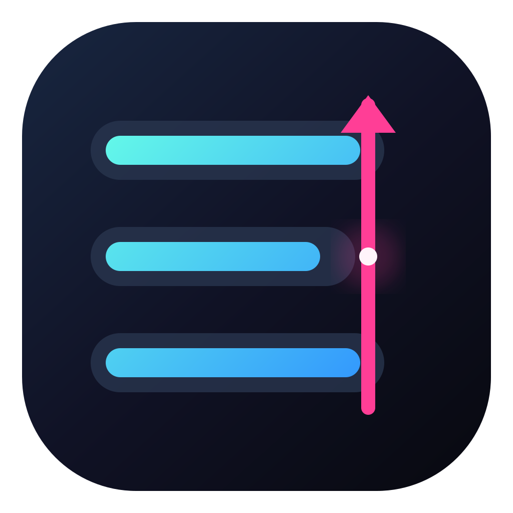
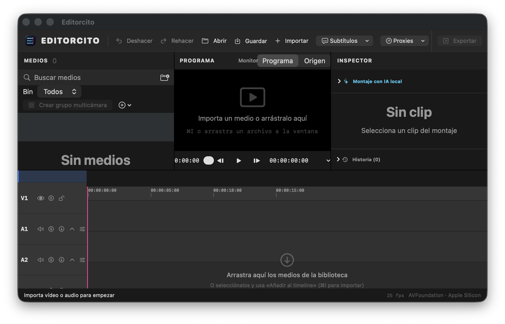
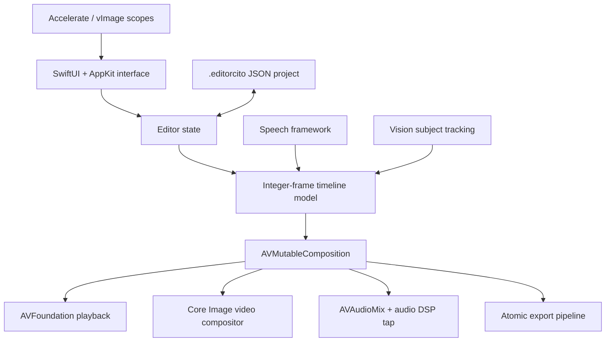

<p align="center">
  
</p>

<h1 align="center">NovaCut</h1>

<p align="center"><strong>Frame-accurate native video editing for macOS.</strong></p>

<p align="center">
  A Swift/AVFoundation editing project exploring transcript-driven cuts, multicam,<br>
  compositing, color, audio DSP and reversible delivery in one native application.
</p>

<p align="center">
  <a href="https://github.com/JesusMonjeGonzalez/NovaCut/actions/workflows/build.yml"></a>
  
  
  
</p>



<p align="center"><sub>The current application bundle still uses its working name, <code>Editorcito.app</code>.</sub></p>

## Why It Is Interesting

NovaCut is not a web UI around FFmpeg. The working macOS application owns its
timeline model and uses native media frameworks from interaction through export.

| Engineering focus | What is implemented |
|---|---|
| Frame correctness | Integer-frame timeline over rational timebases, NTSC fractions and drop-frame timecode |
| Text as an edit surface | On-device transcription, word-level timing, search, filler review and selected-text removal |
| Native composition | AVFoundation playback/export, custom Core Image compositor, masks, blend modes, LUTs and scopes |
| Multicam | Audio-onset sync, manual frame offsets, live switching and flattening into normal clips |
| Audio | Gate, EQ, multiband compression, compressor, limiter, reverb, delay and pan |
| Safe delivery | Temporary output, cancellation and atomic replacement of the destination |

## Editing Surface

- Insert, overwrite, split, lift and ripple-delete operations.
- Ripple/roll trims plus slip and slide edits.
- Linked video/audio synchronization across edits and retiming.
- Constant speed, speed ramps and freeze frames.
- Titles, captions, masks, 14 blend modes and adjustment layers.
- RGB curves, `.cube` LUTs, color wheels, chroma key, waveform, vectorscope and histogram.
- H.264, HEVC, vertical MP4, ProRes 422, audio-only and master export presets.
- **Interchange**: EDL (CMX 3600) and FCPXML 1.11 export with exact timecodes,
  A/V links and constant speeds. External-editor compatibility remains a release
  validation gate, not a claim of full NLE parity.

## Architecture



The Rust crate under `src/core/` is an **experimental cross-platform core
prototype**. It contains timeline/project structures, a RAM frame cache and a
declarative render graph, but it is not linked into the working Swift app yet.

## Build And Run

Requirements:

- macOS 14 or newer on Apple Silicon.
- A recent Xcode installation or Command Line Tools with `swiftc` and the macOS SDK.
- `sips`, `iconutil` and `codesign`, included with macOS/Xcode tooling.
- Rust is optional and is not required to build the macOS application.

```bash
git clone https://github.com/JesusMonjeGonzalez/NovaCut.git
cd NovaCut
./build-mac.sh
open build/Editorcito.app
```

Install the ad-hoc-signed development build into `/Applications`:

```bash
./build-mac.sh instalar
```

There is currently no notarized binary release or installer.

## Verification

```bash
./probar.sh
./probar.sh /path/to/a/redistributable-test-video.mp4
./generar-corpus.sh
./probar-corpus.sh build/corpus
./probar-sonoridad.sh
./probar-sonoridad-media.sh
```

The harness exercises timeline behavior, transcript editing, silence detection,
LUT parsing, scopes, color composition, audio DSP, generated multicam media,
retimed frame progression and EDL/FCPXML model interchange. The optional media
argument adds composition checks against a real file. The golden-media corpus
must contain measurable clap material before its synchronization gate can pass.
The GitHub workflow builds the native application and runs the native harness;
it does not replace UI or heterogeneous-media validation.

## Optional Assisted Editing

NovaCut can request a constrained editing plan from a local or optional remote
model provider. Plans are validated, previewed and applied only after explicit
confirmation; stale plans are rejected if the document changed.

- **Local mode:** can inspect the current frame and keeps requests on the Mac.
- **Remote mode:** receives the instruction, clip names, timecodes, markers and transcript text, but not video frames or audio.

Treat filenames and transcript text as potentially sensitive before choosing a
remote provider.

## Project Files And Recovery

- Projects are JSON documents using the `.editorcito` extension.
- Relative media paths survive project moves when possible.
- Offline media stays in the library and can be relinked.
- Automatic recovery is offered rather than loaded silently.
- Export cancellation preserves any existing destination file.

## Current Limits

- Engineering alpha, not a production NLE replacement.
- Apple Silicon and Spanish-first UI only.
- VFR with dropped frames is detected (PTS scan) and warned, but PTS conforming
  is not implemented yet: the real-VFR corpus gate remains open.
- Reverse playback and retimed multicam clips are not supported.
- Nested clips cannot yet be opened as independently editable sequences.
- Proxy cleanup, storage limits and packaged releases remain unfinished.
- No automated UI suite for recovery, relinking or export cancellation.
- Premiere, Resolve and Final Cut opening have not been verified in this repository.
- Swift concurrency and deprecated AVFoundation warnings remain migration work.

## Repository Map

```text
src/ui/    working native macOS application and media pipeline
src/core/  experimental Rust core prototype
tests/     executable Swift and generated-media harnesses
docs/      architecture, formats, roadmap and user guidance
assets/    application icon
```

Detailed references:

- [User guide](docs/GUIA-USUARIO.md)
- [Formats and codec boundaries](docs/FORMATOS.md)
- [Architecture notes](docs/stack.md)
- [Roadmap](docs/ROADMAP.md)
- [Assisted editing and privacy](docs/IA.md)
